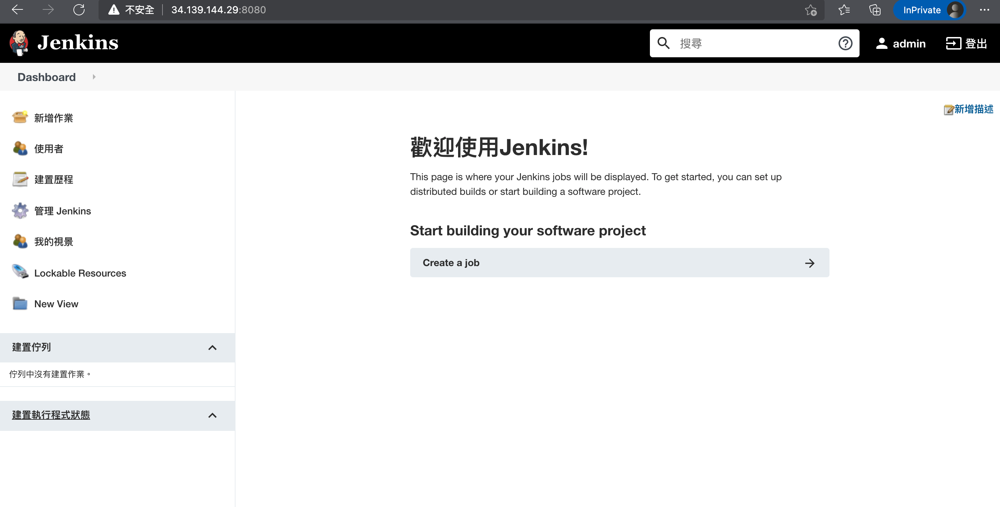

### Setting compute you want.
```bash
( gcloud config set compute/zone us-east1-d )
```

### Clone the sample code.
```bash
( git clone https://github.com/GoogleCloudPlatform/continuous-deployment-on-kubernetes.git )
```

### Navigate to the sample code directory.
```bash
( cd continuous-deployment-on-kubernetes )
```

### Creating a Kubernetes cluster
```bash
( gcloud container clusters create jenkins-cd \
--num-nodes 2 \
--machine-type n1-standard-2 \
--scopes "https://www.googleapis.com/auth/projecthosting,cloud-platform" )
```


### Update Helm repo
```bash
( helm repo add stable https://charts.helm.sh/stable )
"stable" has been added to your repositories

( helm repo update )
Hang tight while we grab the latest from your chart repositories...
...Successfully got an update from the "stable" chart repository
Update Complete. ⎈Happy Helming!⎈
```

### Install Jenkins
```bash
( helm install cd stable/jenkins -f jenkins/values.yaml --version 1.2.2 --wait )

NAME: cdLAST DEPLOYED: Sun Sep 26 09:33:13 2021
NAMESPACE: default
STATUS: deployed
REVISION: 1
NOTES:
1. Get your 'admin' user password by running:
  printf $(kubectl get secret --namespace default cd-jenkins -o jsonpath="{.data.jenkins-admin-password}" | base64 --decode);echo
2. Get the Jenkins URL to visit by running these commands in the same shell:
  NOTE: It may take a few minutes for the LoadBalancer IP to be available.
        You can watch the status of by running 'kubectl get svc --namespace default -w cd-jenkins'
  export SERVICE_IP=$(kubectl get svc --namespace default cd-jenkins --template "{{ range (index .status.loadBalancer.ingress 0) }}{{ . }}{{ end }}")
  echo http://$SERVICE_IP:8080/login

3. Login with the password from step 1 and the username: admin


For more information on running Jenkins on Kubernetes, visit:
https://cloud.google.com/solutions/jenkins-on-container-engine
```

### Check Pod status.
```bash
( kubectl get pods )
NAME                          READY   STATUS    RESTARTS   AGE
cd-jenkins-5bb98d4487-qc5kj   1/1     Running   0          10m
```

### Get Jenkins Pod Name and proxy localhost port to pod port a `8080`.
```bash
( export POD_NAME=$(kubectl get pods --namespace default -l "app.kubernetes.io/component=jenkins-master" -l "app.kubernetes.io/instance=cd" -o jsonpath="{.items[0].metadata.name}")
kubectl port-forward $POD_NAME 8080:8080 >> /dev/null & )
```

### Access from Jenkins svc (load balancer port at `8080`).
```bash
( kubectl get svc )
NAME               TYPE           CLUSTER-IP     EXTERNAL-IP     PORT(S)          AGE
cd-jenkins         LoadBalancer   10.3.243.219   34.139.144.29   8080:32236/TCP   14m
cd-jenkins-agent   ClusterIP      10.3.243.152   <none>          50000/TCP        14m
kubernetes         ClusterIP      10.3.240.1     <none>          443/TCP          16m

# this example ip is 34.139.144.29
# http://34.139.144.29:8080
```

### Get default Admin password
```bash
( printf $(kubectl get secret cd-jenkins -o jsonpath="{.data.jenkins-admin-password}" | base64 --decode);echo )
```

### Example Jenkins UI

